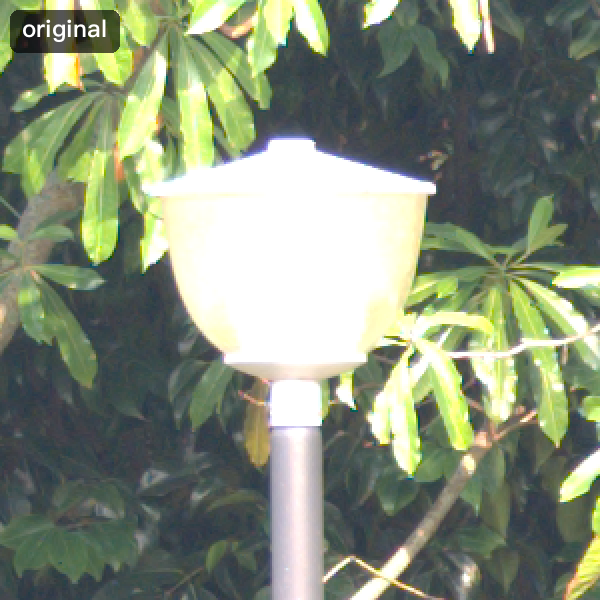
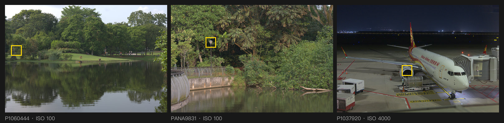
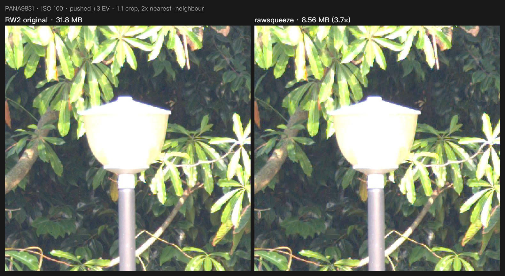
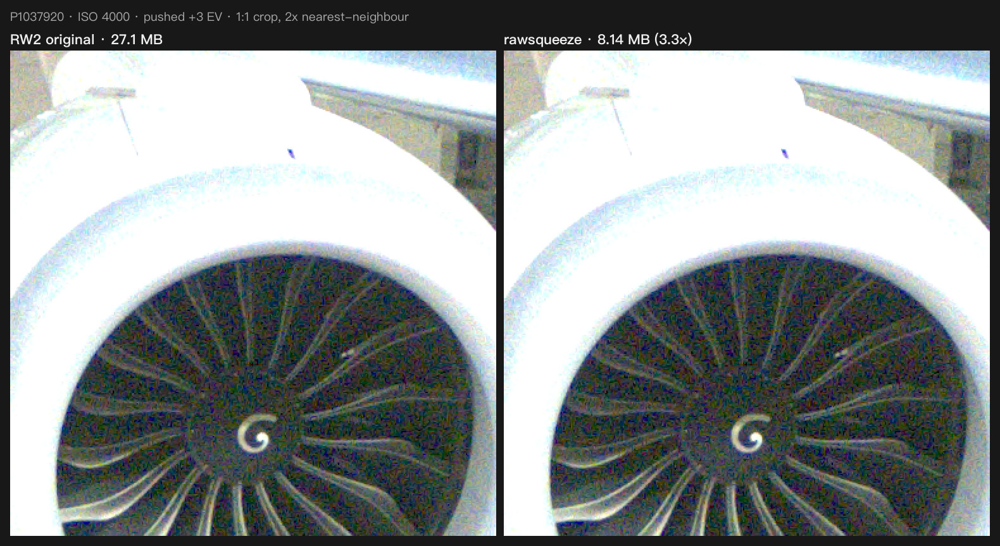
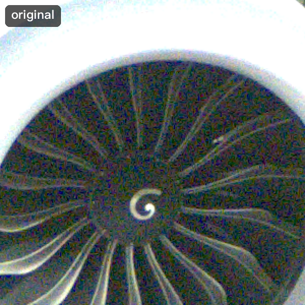
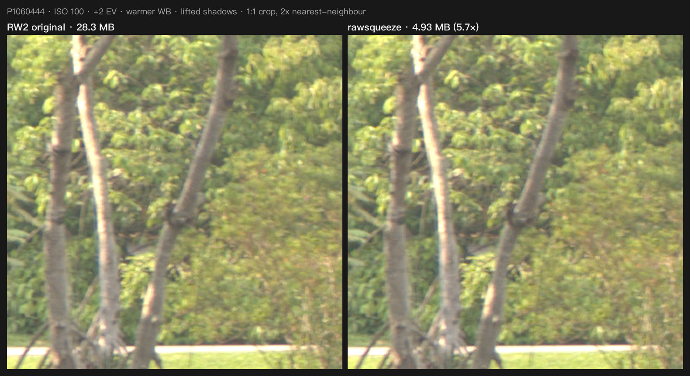
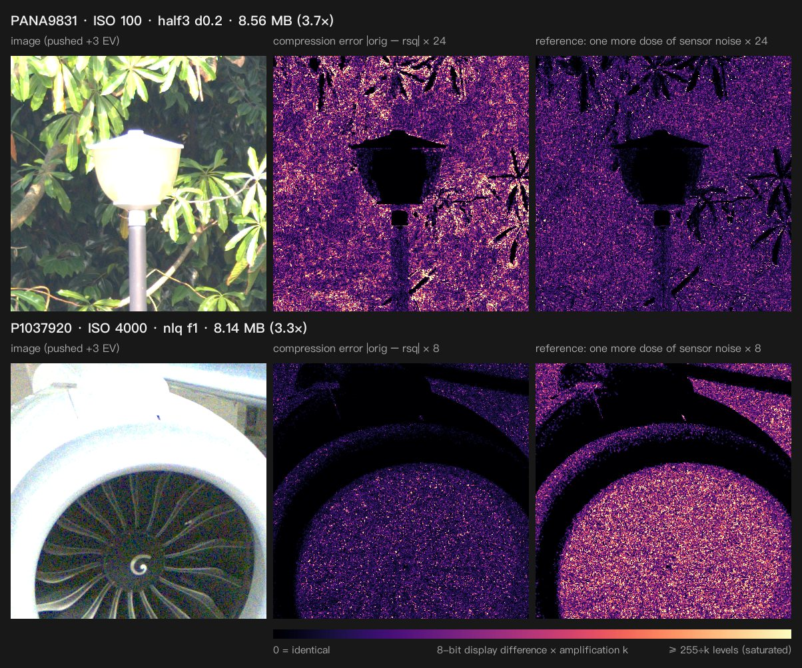
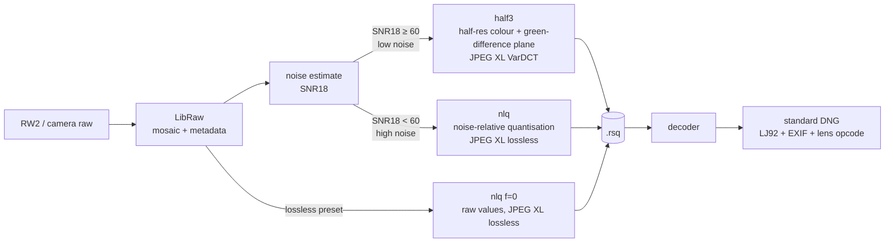
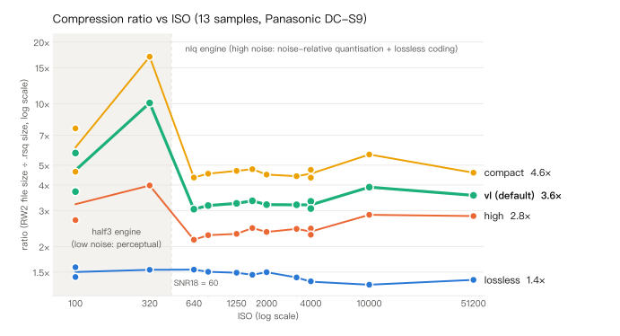
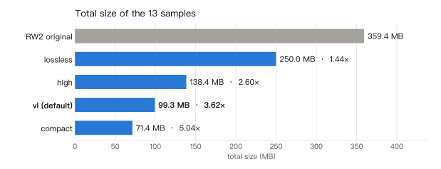

# rawsqueeze

[中文](README.md) | **English**

**At the default preset, shrinks camera RAW files to 1/3–1/10 of their size: no visible difference on low-ISO files even after a +3 EV push; at high ISO the grain statistics are preserved, though a pixel-by-pixel comparison differs. Bit-exact when you need it. (Validated on Panasonic DC-S9 samples.)**

rawsqueeze compresses LibRaw-readable Bayer raw files (fully validated on Panasonic DC-S9 RW2) into `.rsq` files and decodes them back to a standard DNG with the full EXIF / MakerNotes / GPS and the lens distortion correction.

<p align="center">
  
  <br>
  <sub>The image switches between "original" and "compressed" every 0.8 s. PANA9831, ISO 100, pushed +3 EV, 1:1 crop shown 2x. RW2 31.8 MB → .rsq 8.56 MB.</sub>
</p>

| | |
|---|---|
| **3.62× total at the default preset** | 13 samples (ISO 100–51200): 359.4 MB → 99.3 MB |
| **3.7×–10× per low-ISO file** | default preset; the cleaner the image, the smaller the file |
| **Bit-exact lossless mode** | the decoded mosaic equals the original pixel for pixel (sha256-checked); 1.44× total |
| **Fast** | 0.6–1.2 s to encode, about 0.5 s to decode to DNG (8-core M-series Mac, 24 MP) |
| **Decodes to DNG** | standard DNG (lossless LJ92); tested with LibRaw / rawpy and Apple ImageIO (via `sips` and Core Image) |

---

## Contents

- [What it looks like](#what-it-looks-like)
- [Why it gets so small](#why-it-gets-so-small)
- [Quick start](#quick-start)
- [Choosing a preset](#choosing-a-preset)
- [Measurements](#measurements)
- [Compatibility and output](#compatibility-and-output)
- [Limitations and known issues](#limitations-and-known-issues)
- [Development](#development)
- [Acknowledgements](#acknowledgements)

---

## What it looks like

Every comparison below was made the same way: original and compressed file go through the **identical** development (written as a DNG → LibRaw AHD demosaicking, camera white balance, highlight clipping), then get the same edit. Crops are 1:1 sensor pixels upscaled 2x with nearest neighbour: no interpolation, no sharpening. The images come from [`scripts/make_readme_assets.py`](scripts/make_readme_assets.py); you can regenerate them.

<p align="center"></p>
<p align="center"><sub>The three samples; yellow boxes mark the crops below. From left: P1060444 (ISO 100), PANA9831 (ISO 100), P1037920 (ISO 4000, airport at night).</sub></p>

### 1. Low ISO: dark foliage and a highlight edge, pushed +3 EV



Original 31.8 MB, compressed 8.56 MB (3.7×). The leaf texture in the shadows, the bright rim of the lamp and the thin twigs are all there. This file uses the half3 engine (perceptual coding, see [below](#why-it-gets-so-small)).

### 2. High ISO: grain at ISO 4000, pushed +3 EV



Original 27.1 MB, compressed 8.14 MB (3.3×). At high ISO the grain is part of the picture. rawsqueeze does not smooth it away: the grain strength (noise standard deviation) grows by about 4 % in theory, and the measured +3 EV noise ratio for this file is 1.04. This file uses the nlq engine (noise-relative quantisation).

<p align="center">
  
  <br>
  <sub>The same spot as an A/B animation. If you stare at it, the exact grain pattern shimmers slightly at each switch: the compression error is about 0.29× the noise, so sample by sample it differs a little from the original. The grain statistics barely change (noise ratio at +3 EV: 1.04 for this file, 1.03–1.07 across the 10 nlq samples at vl). Looking at single frames we could not tell which one was compressed, but no blind test was run.</sub>
</p>

### 3. Heavy grade: +2 EV, warmer white balance, lifted shadows



Original 28.3 MB, compressed 4.93 MB (5.7×). The grade is applied to the linear demosaicked data (exposure +2 EV, R ×1.18 / B ×0.82, then a shadow-lifting curve), like an ordinary heavy edit.

Look closely and the bark and the fine leaves on the right are slightly softer: half3 smooths very fine, low-contrast texture a little, and the push makes it visible. This is half3's main cost at low ISO; the heatmap below and the SSIMULACRA2 table under [Measurements](#measurements) quantify it (P1060444 scores 82.8 at +3 EV against 90.7 for the FLOOR control). If that matters to you, use the `high` preset: 86.7 on the same file, 7.53 MB.

### 4. How big is the difference? Error heatmaps



Each row, left to right:

1. the image after +3 EV;
2. the difference between original and compressed (8-bit display values, mean of RGB), **amplified k times**, magma colour map (brighter = larger difference);
3. reference: the original **plus one more dose of the same sensor noise** (drawn from this photo's measured noise model), minus the original, amplified by the same k. In other words: how much two shots taken at the same instant would differ anyway.

Pure black means a difference of 0. The large black areas (the lamp shade and sunlit leaves in the top row, the white engine cowling and lip in the bottom row) are places where both images hit the display maximum of 255 after the +3 EV push and are clipped the same way, so the displayed difference is 0; it does not mean the raw data there is error-free. The right end of the colour bar, "≥ 255÷k levels", means any difference of 255÷k levels or more (about 11 in the top row, about 32 in the bottom row) is shown at full brightness. The mean differences quoted below were computed and printed by `scripts/make_readme_assets.py` on these two crops.

How to read it:

- **Bottom row (ISO 4000, nlq, ×8)**: the compression error is clearly darker than column 3. In this crop the mean difference is 3.2 levels, while one dose of sensor noise gives 8.4 levels. The change caused by compression is less than half of the camera's own noise, and it is as uniform and random as the noise: no blocks, no banding, nothing that follows the image structure.
- **Top row (ISO 100, half3, ×24)**: at low ISO the sensor noise itself is small (one dose is only 2.0 levels here), and half3's error (3.4 levels on average) is larger than that. Here the codec does not hide under the noise; it relies on JPEG XL's perceptual coding, which puts the error into the busy dark foliage texture, where the eye is least sensitive, while flat areas like the pole get very little (the lamp shade is black because of display clipping, see above). This is checked with SSIMULACRA2 / Butteraugli at 0 / +2 / +3 EV (see [Measurements](#measurements)), not by eye alone.

Another reference: adding a random 0 or 1 DN to every pixel of the original (the FLOOR control, about the smallest change possible) and scoring that; see the "FLOOR" column in the tables below.

---

## Why it gets so small

### A big part of a raw file is noise

A raw file records how many photons each photosite caught. Photon arrival is random (shot noise), and the readout electronics add more noise, so even a uniform grey wall gives neighbouring pixels different values. That randomness is a large part of the raw data, and **random data cannot be compressed losslessly**. This is why even the best lossless scheme (rawsqueeze's lossless mode) only gets RW2 files down by 1.3–1.6×.

But the **exact values** of that noise carry no information about the picture: take the same shot again and every pixel's noise is different, yet the photo looks the same. What matters is the image itself and the *character* of the noise (grain size, strength, colour).

### Idea 1 (nlq, noisy images): measure with a ruler as fine as the grain

An analogy: measuring the water level of a choppy lake with a ruler accurate to 0.01 mm is pointless when the ripples are several millimetres high. A ruler whose ticks are about as fine as the ripples is enough.

nlq does exactly that:

1. Estimate the noise σ at every brightness from the photo itself (bright areas collect more photons, so their absolute noise is larger).
2. Round every pixel value to the nearest "step", with **step width = f × σ**. The default preset uses f = 1, i.e. one step equals the noise at that brightness. Where the noise is below 1 DN (deep shadows), values are kept as they are.
3. After rounding there are far fewer distinct values; JPEG XL then codes them **losslessly**, and the file shrinks.

The rounding error has an RMS of step/√12 ≈ 0.29σ. Added to the existing noise, the total noise becomes √(1 + 1/12) ≈ **1.04×** the original. So at the default setting, the whole cost is **about 4 % more grain**. Measured at +3 EV: noise ratio 1.03–1.07.

**Why does it survive +3 EV?** A push multiplies signal, noise and error by the same factor (8× for +3 EV), so the error-to-noise ratio stays put. The error is defined relative to the noise, not to some display brightness, so however you push or curve the image, it stays at about 4 % of the grain.

### Idea 2 (half3, clean images): perceptual coding of a "clean" image

At low ISO the noise is small, so noise-sized steps are small too and nlq saves little. rawsqueeze then switches method:

- each 2×2 RGGB block becomes one RGB pixel (white balance and camera matrix applied, linear sRGB): a half-resolution colour image;
- the difference of the two greens (G1 − G2) is stored as its own plane, which brings back the full-resolution luminance detail;
- both are coded with JPEG XL's lossy VarDCT mode, a perceptual codec like JPEG but far better, which places its error where the eye does not see it;
- clipped pixels are restored exactly from a mask, and the few pixels with a large error (threshold 158 DN at d = 0.2) are stored verbatim, so no outlier pixels appear.

### Automatic engine choice

Before encoding, rawsqueeze estimates the noise and computes the signal-to-noise ratio at 18 % grey, SNR18. **SNR18 ≥ 60 → half3, otherwise nlq.** On the DC-S9 that boundary is around ISO 450. It was calibrated on the 13 samples: at high ISO half3 flattens the grain and is no smaller than nlq at equal quality; at low ISO half3 is only 0.29–0.51 of the nlq size.

<details>
<summary>Formulas (optional)</summary>

- Noise model (per CFA position): σ²(x) = g·x + s2, with x the black-subtracted value.
- nlq companding curve: y(x) = x0 + (2 / (g·f))·(√(g·x + s2) − √(g·x0 + s2)) for x ≥ x0, y = x below, with x0 = max((1/f² − s2)/g, 0). The slope is dy/dx = 1/(f·σ(x)), so every integer code is a step of f·σ(x) DN. q = round(y); decoding is a table lookup.
- Quantisation error: RMS ≈ f·σ/√12; resulting noise ratio √(1 + f²/12) = 1.010 / 1.041 / 1.155 for f = 0.5 / 1 / 2 (1 % / 4 % / 15 % more noise).
- Engine choice: x18 = 0.18·(white − black), SNR18 = x18 / √(g·x18 + s2).
- half3: rgb = [R·wbR, (G1+G2)/2, B·wbB] · Mᵀ (M = camera → linear sRGB), D = G1 − G2 + 0.5, both coded with JPEG XL VarDCT at distance d.

Full specification (in Chinese): [docs/DESIGN.md](docs/DESIGN.md).
</details>

### Pipeline



---

## Quick start

### Installation

Requires Python ≥ 3.12 and [uv](https://docs.astral.sh/uv/).

```bash
git clone <repository-url> rawsqueeze
cd rawsqueeze
uv sync

# external tools (macOS / Homebrew)
brew install exiftool   # strongly recommended: EXIF / MakerNotes / GPS in the DNG, ISO at encode
brew install jpeg-xl    # optional: cjxl/djxl (keep camera previews), ssimulacra2 / butteraugli_main (verify)
```

| tool | used for | without it |
|---|---|---|
| `exiftool` | ISO / camera model at encode; EXIF, MakerNotes, GPS into the DNG | DNGs carry only the core DNG tags; no ISO-based noise cap |
| `cjxl`, `djxl` | `--keep-preview` / `--extract-preview` (camera JPEG stored as a lossless JPEG XL transcode) | previews are not stored (warning) |
| `ssimulacra2`, `butteraugli_main` | perceptual metrics in `verify` and `encode --verify` | those metrics cannot be measured: `verify` exits 2; `encode --verify` treats half3 as failed (falls back to nlq) |

Tools are found on `PATH`; `RAWSQUEEZE_<TOOL>` points at a specific binary, e.g. `RAWSQUEEZE_EXIFTOOL=/opt/bin/exiftool`.

### Common commands

All of these were run on the DC-S9 samples; the output is real. Timings are from one typical run, and byte counts may differ by a few bytes with other libjxl / imagecodecs versions.

**Compress one file** (default preset `vl`, automatic engine, output next to the input):

```console
$ uv run rawsqueeze encode P1060444.RW2
[1/1] P1060444.RW2 28.26MB -> 4.93MB (5.73x | raw 4.35x) half3 d0.2 enc 1.4s
done: 1 files (1 encoded, 0 skipped, 0 failed, 0 verify-failed) 28.26MB -> 4.93MB (5.73x) in 1.4s (jobs 1, threads 8)
```

**Decode to DNG**:

```console
$ uv run rawsqueeze decode P1060444.rsq
[1/1] P1060444.rsq -> P1060444.dng 19.82MB half3 lossy dec 0.77s
done: 1 files (1 decoded, 0 skipped, 0 failed) in 0.8s (jobs 1, threads 8)
```

> The DNG is larger than the `.rsq`; that is expected. A DNG uses the generic lossless LJ92 compression so that every application can open it. Keep the `.rsq` as the archive, decode a DNG to edit, and delete it when you are done.

**Compress a directory** (`-r` recurses, `-j 2` runs two files in parallel):

```console
$ uv run rawsqueeze encode photos/ -o out/ -j 2
...
done: 13 files (13 encoded, 0 skipped, 0 failed, 0 verify-failed) 359.44MB -> 99.28MB (3.62x) in 7.7s (jobs 2, threads 4)

$ uv run rawsqueeze decode out/ -o dng/ -j 2
...
done: 13 files (13 decoded, 0 skipped, 0 failed) in 5.1s (jobs 2, threads 4)
```

**Lossless** (sha256 checked on decode):

```console
$ uv run rawsqueeze encode P1060444.RW2 --preset lossless -o P1060444.lossless.rsq
[1/1] P1060444.RW2 28.26MB -> 17.84MB (1.58x | raw 1.20x) nlq lossless enc 0.4s
$ uv run rawsqueeze decode P1060444.lossless.rsq
[1/1] P1060444.lossless.rsq -> P1060444.lossless.dng 20.49MB nlq lossless dec 0.68s lossless-verified
```

**Quick check right after encoding** (2 crops at +3 EV; if auto picked half3 and it fails, the file is re-encoded with nlq):

```console
$ uv run rawsqueeze encode P1037920.RW2 --verify
[1/1] P1037920.RW2 27.07MB -> 8.14MB (3.33x | raw 2.73x) nlq f1 enc 3.3s verify PASS
```

**Full check** (4 crops of 2048² × 0 / +2 / +3 EV, about 17–24 s per file):

```console
$ uv run rawsqueeze verify P1060444.rsq --original P1060444.RW2
P1060444.rsq: 4,929,549 bytes (file 5.73x, raw 4.35x), decode 0.1792s
engine=half3 preset=vl mode=lossy tiles=['center', 'darkest', 'variance', 'random'] equal=False
+0EV ss2 87.72 ds2 92.93 ba 2.64/0.636 psnr 41.06 | FLOOR ss2 93.39 psnr 54.99
+2EV ss2 85.01 ds2 91.66 ba 3.54/0.863 psnr 36.42 | FLOOR ss2 92.06 psnr 50.17
+3EV ss2 82.82 ds2 90.48 ba 4.15/0.970 psnr 34.99 | FLOOR ss2 90.69 psnr 48.08
noise: rmse/sigma max 3.059 |bias8| 0.014 noise ratio 0.9653
clip: {'n_clipped': 230819, 'inconsistent': 0, 'false_clip': 0}
acceptance: PASS []
```

**Inspect a file**:

```console
$ uv run rawsqueeze info P1060444.rsq
P1060444.rsq: rsq v1.0, 4,929,549 bytes (5.73x vs P1060444.RW2)
  half3 lossy preset=vl d0.2  mosaic 6016x4016 Panasonic DC-S9 ISO 100
... (the full HEAD JSON and chunk list follow; omitted here)
```

**Keep the camera's embedded JPEG** (not kept by default, see [limitations](#limitations-and-known-issues)):

```bash
uv run rawsqueeze encode IMG.RW2 --keep-preview small   # store the small preview (+0.74 MB on P1060444)
uv run rawsqueeze decode IMG.rsq --extract-preview      # also writes IMG.JpgFromRaw.jpg, bit-exact
```

More: `--preset high|vl|compact|lossless|archival`, `--engine half3|nlq` to force an engine, `--skip-existing`, `--dry-run`, `--json` for JSON reports. See `uv run rawsqueeze <command> --help` for every option.

Exit codes: 0 ok; 1 error (any file); 2 verify below threshold or a required metric not measurable; 130 interrupted (Ctrl-C stops a batch at once and prints the partial summary).

From Python:

```python
import rawsqueeze
rep = rawsqueeze.encode_file("IMG.RW2", "IMG.rsq", preset="vl")
print(rep.engine, rep.param, rep.ratio_file)
rawsqueeze.decode_file("IMG.rsq", "IMG.dng")
```

---

## Choosing a preset

In short: **use the default `vl` day to day, `high` for high-ISO shots you will grade hard, and `lossless` when the raw data must stay identical.**

| preset | low noise (half3) | high noise (nlq) | measured ratio (13 samples) | total | guarantees | use for |
|---|---|---|---|---|---|---|
| `lossless` | – | f = 0 | 1.30–1.58× | 1.44× | bit-exact mosaic, sha256 checked on decode | archives that must match the original |
| `archival` | – | f = 0 | slightly below lossless | – | lossless + the camera's small JPEG preview (+0.74 MB on P1060444) | archives that keep the in-camera JPEG |
| `high` | d = 0.1 | f = 0.5 | 2.16–3.98× | 2.60× | about 1 % more grain; verified up to +3 EV, suited to heavy grading (high ISO checked by noise-relative criteria) | work you will edit heavily |
| **`vl` (default)** | **d = 0.2** | **f = 1** | **3.05–10.08×** | **3.62×** | about 4 % more grain; low ISO (half3): near visually lossless after +2 to +3 EV; high ISO (nlq): noise statistics preserved, pixel-wise scores low (see [verification](#how-no-visible-difference-was-checked)) | everyday use |
| `compact` | d = 0.3 | f = 2 | 4.34–16.96× | 5.04× | about 15 % more grain; visible grain change on high-ISO files pushed +3 EV | space first, little editing |

- `high` means **higher fidelity**, not higher compression.
- The ratio depends mostly on the scene: P1060384 (ISO 320, large blurred background) reaches 10× at the default, the leaf-filled PANA9831 (ISO 100) 3.7×.
- "More grain" is the theoretical √(1 + f²/12); measured +3 EV noise ratios are 1.01–1.02 (high), 1.03–1.07 (vl), 1.06–1.20 (compact).

---

## Measurements

All numbers are from [docs/STATUS.md](docs/STATUS.md) and [docs/results/final_results.csv](docs/results/final_results.csv): 13 Panasonic DC-S9 samples (6016×4016, 12-bit, ISO 100–51200), 8-core M-series Mac, 8 threads. MB = 10⁶ bytes; `.rsq` sizes include the metadata.

<picture>
  <source media="(prefers-color-scheme: dark)" srcset="docs/images/chart_ratio_iso_en_dark.svg">
  
</picture>

Every one of the 13 samples is plotted (ISO 800, 1600 and 3200 have short ticks without labels). ISO 100 and ISO 4000 have two samples each; both points are drawn and the line joins their mean. The shaded band is where the half3 engine is used (SNR18 ≥ 60, below about ISO 450 on this camera).

<picture>
  <source media="(prefers-color-scheme: dark)" srcset="docs/images/chart_totals_en_dark.svg">
  
</picture>

### Per file

Ratio = RW2 file size ÷ `.rsq` size. high and compact use the same engine as vl (the same SNR18 decision); lossless is always nlq f = 0.

| file | ISO | engine (vl) | RW2 MB | lossless | high | vl (default) | compact |
|---|---:|---|---:|---:|---:|---:|---:|
| P1060444 | 100 | half3 d0.2 | 28.3 | 17.84 MB · 1.58× | 7.53 MB · 3.75× | **4.93 MB · 5.73×** | 3.74 MB · 7.56× |
| PANA9831 | 100 | half3 d0.2 | 31.8 | 22.39 MB · 1.42× | 11.80 MB · 2.69× | **8.56 MB · 3.71×** | 6.84 MB · 4.64× |
| P1060384 | 320 | half3 d0.2 | 23.6 | 15.33 MB · 1.54× | 5.93 MB · 3.98× | **2.34 MB · 10.08×** | 1.39 MB · 16.96× |
| ISO640_PANA0036 | 640 | nlq f1 | 24.7 | 15.99 MB · 1.54× | 11.42 MB · 2.16× | **8.10 MB · 3.05×** | 5.67 MB · 4.35× |
| ISO800_PANA0021 | 800 | nlq f1 | 25.2 | 16.73 MB · 1.50× | 11.08 MB · 2.27× | **7.93 MB · 3.17×** | 5.54 MB · 4.54× |
| ISO1250_P1060413 | 1250 | nlq f1 | 25.6 | 17.21 MB · 1.49× | 11.11 MB · 2.31× | **7.88 MB · 3.25×** | 5.47 MB · 4.69× |
| ISO1600_PANA9976 | 1600 | nlq f1 | 27.5 | 18.92 MB · 1.46× | 11.17 MB · 2.46× | **8.22 MB · 3.35×** | 5.76 MB · 4.78× |
| ISO2000_PANA9996 | 2000 | nlq f1 | 27.4 | 18.29 MB · 1.50× | 11.63 MB · 2.36× | **8.55 MB · 3.21×** | 6.09 MB · 4.50× |
| ISO3200_PANA9944 | 3200 | nlq f1 | 29.6 | 20.95 MB · 1.41× | 12.12 MB · 2.44× | **9.24 MB · 3.20×** | 6.70 MB · 4.42× |
| P1037920 | 4000 | nlq f1 | 27.1 | 20.20 MB · 1.34× | 11.05 MB · 2.45× | **8.14 MB · 3.33×** | 5.71 MB · 4.74× |
| PANA0003 | 4000 | nlq f1 | 26.0 | 19.23 MB · 1.35× | 11.39 MB · 2.28× | **8.48 MB · 3.07×** | 5.99 MB · 4.34× |
| ISO10000_PANA9951 | 10000 | nlq f1 | 29.4 | 22.57 MB · 1.30× | 10.28 MB · 2.86× | **7.53 MB · 3.90×** | 5.21 MB · 5.64× |
| ISO51200_PANA0010 | 51200 | nlq f1 | 33.4 | 24.32 MB · 1.37× | 11.85 MB · 2.82× | **9.38 MB · 3.56×** | 7.27 MB · 4.59× |
| **total** | | | 359.4 | 250.0 MB · 1.44× | 138.4 MB · 2.60× | **99.3 MB · 3.62×** | 71.4 MB · 5.04× |

**Part of the saving is the preview.** 16–24 % of an RW2 file is the camera's embedded JPEG preview, which rawsqueeze does not keep by default. Measured against the raw image data alone, the vl total is 2.89× (lossless 1.15×, high 2.07×, compact 4.02×). Both ratios are in the CSV for every file.

### Speed

| | encode (read, noise estimate, write) | decode to DNG (incl. EXIF and lens opcode) |
|---|---|---|
| lossless | 0.41–0.46 s | 0.49–0.62 s |
| high / vl / compact, nlq | 0.62–0.73 s | 0.48–0.58 s |
| high / vl / compact, half3 | 1.16–1.26 s | 0.48–0.58 s |

Command line (including Python start-up): encode 1.4–1.6 s, decode 0.8 s per file. Batch `-j 2`: 13 files encode in 7.7–8.3 s, decode in 5.1–6.0 s.

### How "no visible difference" was checked

Eyes alone are not enough, and neither is a single score. Every lossy file (13 samples × 3 lossy presets = 39 files) went through a full `rawsqueeze verify`:

1. **Development**: original and compressed are each written as a DNG and developed with LibRaw AHD, camera white balance and highlight clipping, at 0 / +2 / +3 EV. Both sides go through bit-identical processing.
2. **The hardest spots**: four 2048×2048 crops per image (centre, darkest, most detailed, random); the worst one counts.
3. **Perceptual metrics**: SSIMULACRA2 (higher is better; on its author's scale 90 is essentially indistinguishable at normal viewing distance and 70 is high quality where artefacts are hard to notice without a side-by-side comparison) and Butteraugli (lower is better; a 3-norm around 1 or below is usually invisible).
4. **FLOOR control**: add a random 0 or 1 DN to each pixel of the original and score that. It is about the smallest possible change, so its score is the "ceiling" for that image.
5. **Noise-relative checks** (nlq): error / noise (RMSE/σ), noise ratio after +3 EV, colour bias in flat areas. They confirm the error is exactly the small amount of noise intended, with no colour shift and no change to the grain.
6. **Highlights**: clipped areas must match the original exactly (0 mismatching pixels in all 39 files).
7. **By eye**: the 3 low-ISO half3 files were compared with the originals at 4× and +3 EV; no visible difference. The high-ISO nlq files were not compared by eye like this; they are validated by the noise-relative checks in step 5 (step 4's FLOOR control shows why pixel-wise scores cannot be high there anyway).

Result: **39 / 39 pass** (thresholds depend on d / f; see [DESIGN.md section 6.4](docs/DESIGN.md)); lossless 13 / 13 bit-exact (mosaic and DNG).

Selected results for the default preset `vl` (+3 EV, worst of 4 crops):

| file | ISO | engine | SSIMULACRA2 | Butteraugli 3-norm | FLOOR control SSIMULACRA2 |
|---|---:|---|---:|---:|---:|
| P1060444 | 100 | half3 d0.2 | 82.8 | 0.97 | 90.7 |
| PANA9831 | 100 | half3 d0.2 | 76.8 | 1.23 | 89.6 |
| P1060384 | 320 | half3 d0.2 | 77.2 | 1.08 | 87.5 |
| ISO800_PANA0021 | 800 | nlq f1 | 75.1 | 1.03 | 85.3 |
| P1037920 | 4000 | nlq f1 | 38.5 | 1.75 | 72.2 |
| ISO51200_PANA0010 | 51200 | nlq f1 | 13.1 | 3.02 | 75.9 |

**Why are the high-ISO scores so low?** Full-reference metrics like SSIMULACRA2 compare against the original pixel by pixel. At high ISO the grain dominates, and if its exact pattern changes, the score drops a lot even when the grain is statistically identical. The FLOOR column shows this: on ISO 4000, adding just 0/1 DN brings the +3 EV score down to 72. So for nlq the acceptance criteria are the noise-relative ones (error about 29 % of the noise, grain strength after the push only 3–7 % higher), not the absolute score. The ISO 4000 comparison and animation above show what such a "low score" actually looks like.

---

## Compatibility and output

**DNG**

- Pixels are LJ92 (lossless JPEG) compressed in tiles, in the same layout as Adobe DNG Converter (256×256 tiles, 2 interleaved components).
- Tested: LibRaw / rawpy (a lossless file reads back bit-identical to the original), imagecodecs, Apple ImageIO (tested through `sips` and Core Image; the Preview and Photos apps themselves were not tested). The rawspeed-compatible layout (darktable's decoder) was checked structurally only. **darktable and Adobe Lightroom / ACR have not been tested yet.**
- Metadata: from a metadata skeleton saved from the original file, one exiftool call writes back EXIF (41 ExifIFD tags), Panasonic MakerNotes (119), GPS (13), plus capture date, artist, copyright and the original file name.
- Lens distortion: the Panasonic in-camera distortion correction is converted to a DNG `OpcodeList3 WarpRectilinear`. Software that applies it (e.g. Apple) corrects automatically; median corner residual on the 13 samples is 0.14–0.54 px. LibRaw / darktable ignore it. `decode --no-lens-opcode` turns it off.
- `--dng-compression none12|none16` writes uncompressed DNGs.

**The .rsq container**

A PNG-like chunked format: a header (magic + version), then a sequence of chunks, each with a CRC32, and an index plus end marker at the end. The main chunks are HEAD (JSON: engine, parameters, noise model, black/white levels, colour matrices, sha256 of the original mosaic, ...), the image data (JPEG XL codestreams), META (the compressed metadata skeleton) and optional preview JPEGs. A damaged or truncated file gives a clear error instead of silently decoding a wrong image. Details: [DESIGN.md section 3](docs/DESIGN.md).

**What is lossless**

| | lossless / archival | high / vl / compact |
|---|---|---|
| mosaic pixels | bit-exact (sha256 checked) | lossy (error controlled by noise or perception); clipped pixels restored exactly |
| EXIF / MakerNotes / GPS | kept | kept |
| embedded camera JPEG | kept by archival, not by lossless (default) | not kept by default (`--keep-preview` keeps it bit-exact) |
| the RW2 file's bytes | not reproduced (you get a DNG, not an RW2) | not reproduced |

**Camera support**: fully validated with real data only on Panasonic DC-S9 RW2. The design targets every 2×2 Bayer camera LibRaw opens, but other models and formats (CR3, NEF, ARW, ...) have not been tested with real files. Non-Bayer sensors (e.g. Fujifilm X-Trans) are lossless only.

---

## Limitations and known issues

- **One camera tested.** All measurements come from the Panasonic DC-S9. Other cameras are untested: they may or may not work, and the ratios, the noise table and the lens opcode are unverified there (non-RW2 input was only exercised with DNG test fixtures).
- **The embedded camera JPEG is dropped by default.** That saves 4.1–6.8 MB per file (16–24 % of the RW2) and is part of the compression ratio. Use `--keep-preview small|full` or `--preset archival` to keep it.
- **The decoded DNG is larger than the `.rsq`** (measured at vl: 15.6–25.0 MB per file, 247 MB for the 13 samples). Edit the DNG, archive the `.rsq`.
- **Lossy decoding is not guaranteed bit-reproducible across versions.** half3 decodes in floating point, so different libjxl versions or platforms may differ very slightly (HEAD records the libjxl version and a reconstruction sha256 for checking). nlq lossy and lossless are exact.
- **compact is not for high-ISO files you will push.** At f = 2 the grain grows by about 15 % and a +3 EV push shows the grain change (SSIMULACRA2 down to −34 at ISO 51200). Use vl or high for those.
- **`encode --verify` is a quick check** (2 crops, +3 EV only); run `rawsqueeze verify` for the full one.
- **The gat4 engine is experimental**, not quality-validated, and never chosen by auto.
- **Non-Bayer CFAs are lossless only**; the lossy refusal for cameras with a 2-D black-level pattern in LibRaw is not implemented.
- **The lens opcode** was validated only on the DC-S9 with the LUMIX S 24-60 and 70-300 at 3:2; lateral chromatic aberration is not converted; Lightroom / ACR untested.
- **Small nlq bias**: on the PANA0003 night sky the integer lookup table causes a mean error of −0.14 to −0.28 DN (within the acceptance criteria; can be improved).
- **Memory**: two full `verify` runs on 24 MP files at once can exceed memory on small machines. `--dry-run` reports the requested engine, not the one auto would pick.

---

## Development

```bash
uv run pytest -q -m "not slow"   # fast tests (417, about 11 s, no samples needed)
uv run pytest -q -m slow         # tests that need samples/*.RW2
uv run pytest -q                 # everything (459, about 1.5 min)
```

```
rawsqueeze/
  cli.py          command line (encode / decode / info / verify / bench)
  pipeline.py     public API: encode_file / decode_file / verify_file, ...
  engines/        nlq.py, half3.py, gat4.py
  noise.py        noise model estimate; noise_table.py holds per-camera ISO caps
  select.py       engine choice (SNR18)
  container.py    .rsq reader / writer
  dng.py          DNG writer (LJ92, tags, lens opcode)
  meta.py         metadata skeleton, EXIF transfer
  verify.py       development, metrics, acceptance criteria
  bench.py        parameter sweeps
scripts/make_readme_assets.py   regenerates every image in this README
docs/DESIGN.md                  design specification (Chinese)
docs/STATUS.md                  implementation status and final measurements
docs/results/final_results.csv  data behind the charts
```

Regenerate the README images (needs the RW2 files in `samples/`; charts need only the CSV):

```bash
uv run python scripts/make_readme_assets.py                 # everything, about 45 s (8-core M-series Mac, no --cache)
uv run python scripts/make_readme_assets.py --only charts   # charts only
uv run python scripts/make_readme_assets.py --table en      # print the per-file table above
```

The script encodes the samples with the real presets, decodes them and develops them through the same pipeline as the originals, so every size and pixel in the images is the actual output of the current code.

---

## Acknowledgements

rawsqueeze is built on:

- [JPEG XL / libjxl](https://github.com/libjxl/libjxl): the coding core of both engines, plus cjxl / djxl
- [LibRaw](https://www.libraw.org/) and [rawpy](https://github.com/letmaik/rawpy): raw decoding and the verification development
- [imagecodecs](https://github.com/cgohlke/imagecodecs): JPEG XL and LJ92 codecs
- [PiDNG](https://github.com/schoolpost/PiDNG): DNG writing
- [ExifTool](https://exiftool.org/): metadata
- [SSIMULACRA2](https://github.com/cloudinary/ssimulacra2) and [Butteraugli](https://github.com/google/butteraugli): perceptual quality metrics
- and NumPy, scikit-image, tifffile, zstandard, matplotlib
