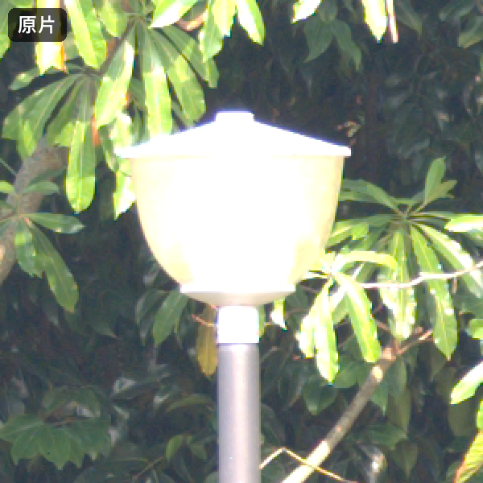
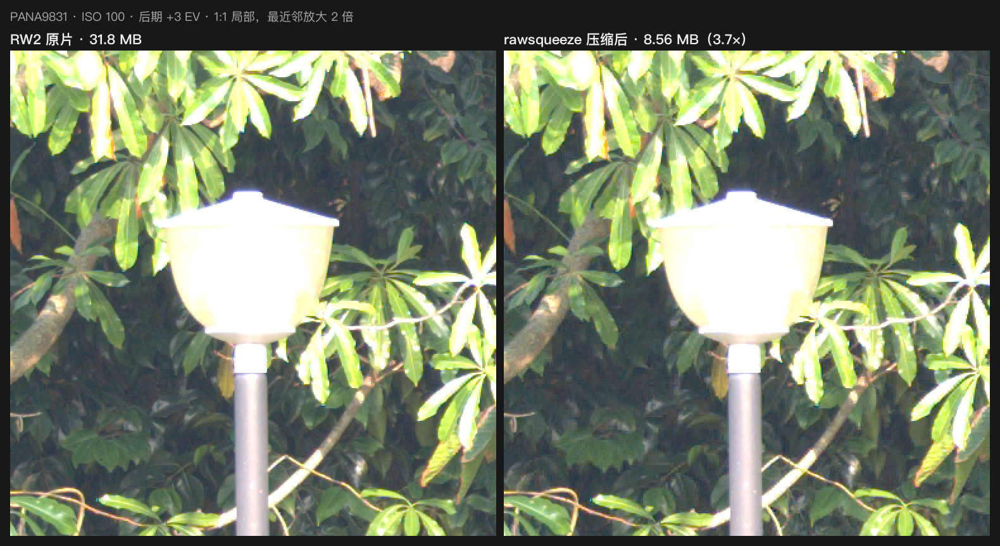
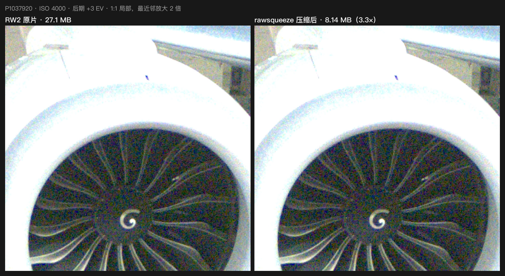
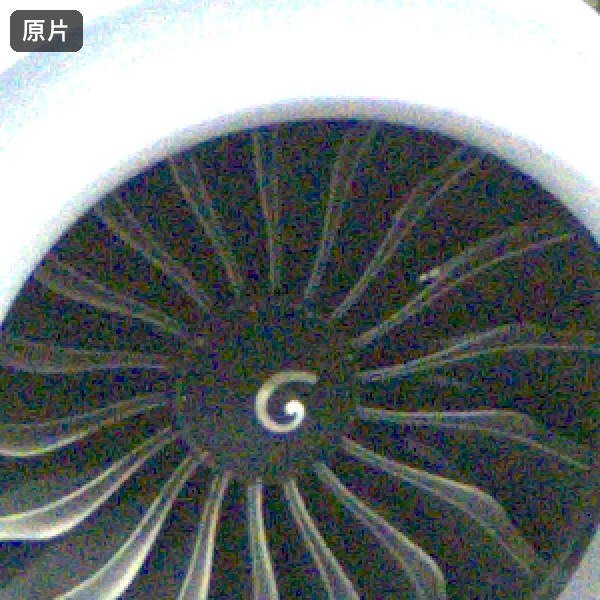
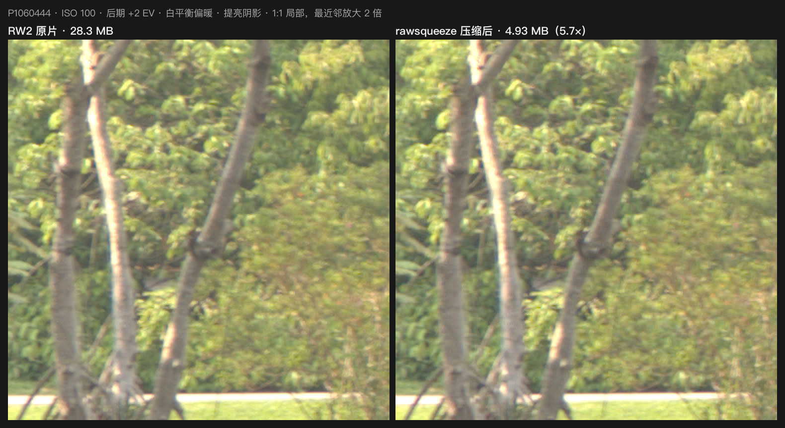
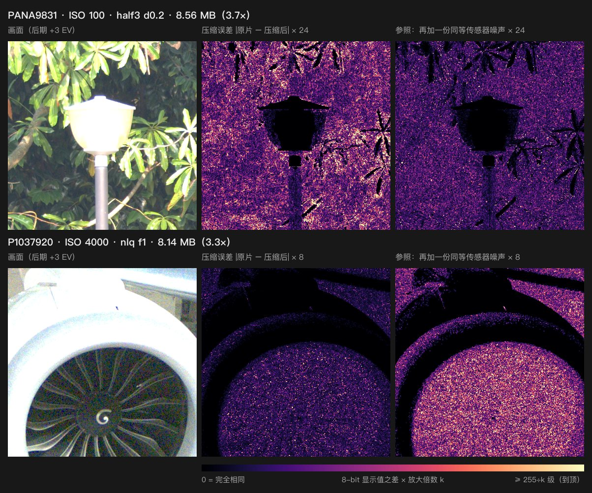
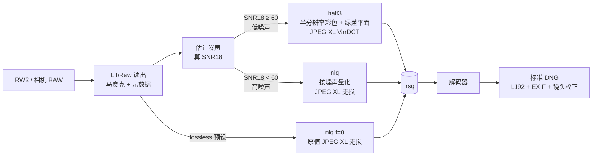
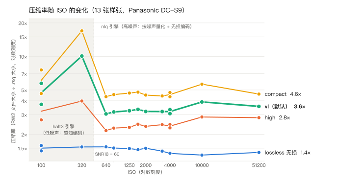
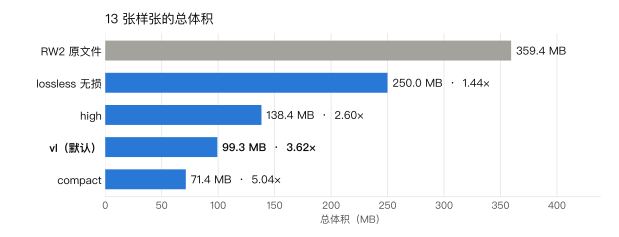

# rawsqueeze

**中文** | [English](README.en.md)

**默认预设下把相机 RAW 压到原来的 1/3～1/10：低 ISO 照片后期推 +3 EV 也看不出差别；高 ISO 照片保留颗粒的统计特征，但逐像素比对会有差异；需要时也能逐位无损。（在 Panasonic DC-S9 样张上验证）**

rawsqueeze 把 LibRaw 能读的 Bayer RAW（目前在 Panasonic DC-S9 的 RW2 上完整验证）压成 `.rsq` 文件，需要用的时候再解回一张标准 DNG，带完整的 EXIF / MakerNotes / GPS 和镜头畸变校正参数。

<p align="center">
  
  <br>
  <sub>上图每 0.8 秒在「原片」和「压缩后」之间切换一次。PANA9831，ISO 100，后期 +3 EV，1:1 局部放大 2 倍。RW2 31.8 MB → .rsq 8.56 MB。</sub>
</p>

| | |
|---|---|
| **默认预设总体积 3.62×** | 13 张样张（ISO 100–51200）从 359.4 MB 压到 99.3 MB |
| **低 ISO 单张 3.7×–10×** | 默认预设；低 ISO 画面越干净，压得越小 |
| **无损模式逐位一致** | 解码后的马赛克和原片逐个像素相同（sha256 校验），总体积 1.44× |
| **快** | 单张编码 0.6–1.2 s，解码出 DNG 约 0.5 s（8 核 M 系列 Mac，2400 万像素） |
| **出来就是 DNG** | 标准 DNG（LJ92 无损压缩），LibRaw / rawpy 和 Apple ImageIO（用 `sips` 和 Core Image 测试）已实测能打开 |

---

## 目录

- [效果一览](#效果一览)
- [为什么能压这么小](#为什么能压这么小)
- [快速开始](#快速开始)
- [怎么选预设](#怎么选预设)
- [实测数据](#实测数据)
- [兼容性与输出](#兼容性与输出)
- [局限与已知问题](#局限与已知问题)
- [开发](#开发)
- [致谢](#致谢)

---

## 效果一览

下面所有对比图都是这样做出来的：原片和压缩后的文件走**完全相同**的显影流程（写成 DNG → LibRaw AHD 去马赛克、相机白平衡、高光裁切），再做同样的后期。局部都是 1:1 的传感器像素，用最近邻放大 2 倍，没有任何插值或锐化。生成这些图的脚本是 [`scripts/make_readme_assets.py`](scripts/make_readme_assets.py)，可以自己重跑。

<p align="center"></p>
<p align="center"><sub>三张样张全图，黄框是下面局部图的位置。左起：P1060444（ISO 100）、PANA9831（ISO 100）、P1037920（ISO 4000，夜间机场）。</sub></p>

### 1. 低 ISO：暗部树叶 + 高光边缘，推 +3 EV



原片 31.8 MB，压缩后 8.56 MB（3.7×）。暗处的树叶纹理、灯罩亮边、细树枝都在。这张走的是 half3 引擎（感知编码，见[下文](#为什么能压这么小)）。

### 2. 高 ISO：ISO 4000 夜景，推 +3 EV 之后的颗粒



原片 27.1 MB，压缩后 8.14 MB（3.3×）。高 ISO 的颗粒本身就是画面的一部分。rawsqueeze 不会把它抹平：颗粒强度（噪声标准差）理论上只多约 4%，这张图 +3 EV 下实测的噪声比是 1.04。这张走的是 nlq 引擎（按噪声大小量化）。

<p align="center">
  
  <br>
  <sub>同一处的交替动画。在高 ISO 下仔细盯着看，切换时颗粒的「具体排布」会有轻微跳动：压缩误差大约是噪声的 0.29 倍，一个样本一个样本地比，会和原片略有不同。但颗粒的统计特征基本不变（这张图 +3 EV 下的噪声比是 1.04，vl 预设下 10 张 nlq 样张都在 1.03–1.07 之间）。我们自己单看任何一帧时分不出哪张是压缩过的，不过没有做过盲测。</sub>
</p>

### 3. 重度调色：+2 EV、白平衡偏暖、提亮阴影



原片 28.3 MB，压缩后 4.93 MB（5.7×）。调色是在去马赛克后的线性数据上做的（曝光 +2 EV，R ×1.18 / B ×0.82，再拉一条提亮阴影的曲线），模拟一次常规的重度后期。

仔细比的话，右边树皮和细碎树叶的纹理略软一点：half3 会把很细、反差很低的纹理稍微抹平，推亮之后能看出来。这是低 ISO 下 half3 的主要代价，量化结果见下面的热力图和[实测数据](#实测数据)里的 SSIMULACRA2 表（P1060444 在 +3 EV 下 82.8 分，FLOOR 对照 90.7）。在意这一点就用 `high` 预设：同一张 86.7 分，7.53 MB。

### 4. 差异到底有多大：误差热力图



每一行从左到右：

1. 后期 +3 EV 之后的画面；
2. 原片和压缩后之差（8-bit 显示值，取 RGB 平均），**放大 k 倍**后用 magma 色表显示，越亮差得越多；
3. 参照：在原片上**再叠加一份同样强度的传感器噪声**（按这张照片实测的噪声模型随机生成），再和原片相减，放大同样的倍数。第 3 列等于在问：要是相机在同一瞬间再拍一张，两张之间本来就会差多少。

纯黑表示差为 0。大块纯黑的地方（上排的灯罩和被阳光照亮的叶子，下排发动机的白色外壳和唇口）是推 +3 EV 之后两张图都到了显示的最亮值 255，被同样裁掉，所以显示出来的差是 0，并不说明那里的 RAW 数据没有误差。色条右端的「≥ 255÷k 级」是说差达到 255÷k 级（上排约 11 级，下排约 32 级）就显示成最亮。下面的平均差数值是 `scripts/make_readme_assets.py` 在这两个局部上算出并打印的。

怎么看：

- **下排（ISO 4000，nlq 引擎，放大 8 倍）**：压缩误差明显比第 3 列暗。这个局部里平均差 3.2 级，而一份传感器噪声带来的差是 8.4 级。也就是说，压缩带来的变化不到相机自己噪声的一半，而且误差和噪声一样均匀、随机，没有块、没有条纹，也不跟着画面结构走。
- **上排（ISO 100，half3 引擎，放大 24 倍）**：低 ISO 时传感器噪声本身很小（这里一份噪声只差 2.0 级），half3 的误差平均 3.4 级，比噪声大。这里不靠「藏在噪声下面」，靠的是 JPEG XL 的感知编码：误差集中在杂乱的暗部树叶纹理里，那正是人眼最不敏感的地方；灯杆这样的平坦区域误差很小（灯罩全黑是因为显示裁切，见上文）。这一点是用 SSIMULACRA2 / Butteraugli 在 0 / +2 / +3 EV 下验收的（见[实测数据](#实测数据)），不是凭感觉。

还有一个参照：只给原片每个像素随机加 0 或 1 DN（FLOOR 对照，几乎是能想到的最小改动），这样做出的图在全参考指标上的得分，见下文表格里的「FLOOR」一栏。

---

## 为什么能压这么小

### RAW 里有一大块其实是噪声

一张 RAW 记下的是每个感光点收到的光子数。光子到达本身就是随机的（散粒噪声），再加上电路的读出噪声，所以就算对着一面均匀的灰墙拍，相邻像素的数值也会上下跳动。这份随机性占了 RAW 数据的很大一部分，而**随机数据是没法无损压缩的**。这就是为什么即使是最好的无损方案（rawsqueeze 的 lossless 模式），也只能把 RW2 压到 1.3–1.6×。

但这些噪声的**具体数值**对照片毫无意义：同一瞬间再拍一张，每个像素的噪声都会变，照片看起来却完全一样。真正需要保留的是画面本身，以及噪声的「样子」（颗粒多粗、多亮、什么颜色）。

### 思路一（nlq，高噪声照片）：颗粒有多粗，就用多粗的尺子

打个比方：水面上全是细浪，你要记录水位，拿精确到 0.01 毫米的尺子去量毫无意义，浪一过来就是好几毫米的起伏。用一把刻度和浪差不多细的尺子就够了。

nlq 就是这么做的：

1. 先从照片本身估计每个亮度下的噪声大小 σ（亮的地方光子多，噪声的绝对值也大）。
2. 每个像素值四舍五入到最近的「台阶」上，**台阶宽度 = f × σ**。默认预设 f = 1，也就是台阶宽度正好等于这个亮度下的噪声。暗部噪声不到 1 DN 的地方保持原值不动。
3. 四舍五入之后，数值的种类少了很多，再交给 JPEG XL 做**无损**编码，体积就小了。

四舍五入带来的误差，均方根是台阶宽度的 1/√12，约 0.29σ。它和原有噪声叠加后，总噪声变成原来的 √(1 + 1/12) ≈ **1.04 倍**。换句话说，默认设置下的全部代价，就是**颗粒多了约 4%**。实测 +3 EV 下的噪声比是 1.03–1.07。

**为什么推 +3 EV 也不怕？** 推曝光是把信号、噪声和误差一起放大 8 倍，误差和噪声的比例不变。误差是按噪声定的，不是按某一种显示亮度定的，所以无论怎么推、怎么拉曲线，它始终只占颗粒的那 4%。

### 思路二（half3，低噪声照片）：用感知编码压一张「干净」的图

ISO 很低时，噪声本来就小，按噪声定的台阶也很窄，nlq 省不了多少空间。这时 rawsqueeze 换一种方法：

- 把每个 2×2 的 RGGB 像素块合成一个 RGB 像素（乘白平衡和相机矩阵，变成线性 sRGB），得到一张半分辨率的彩色图；
- 两个绿色像素之差（G1 − G2）单独存成一个平面，把全分辨率的亮度细节补回来；
- 两部分都用 JPEG XL 的 VarDCT 有损编码。它和 JPEG 一样是感知编码，但效果好得多，会把误差放到人眼看不出来的地方；
- 过曝的像素用一张掩码精确恢复；个别误差偏大的像素（默认阈值：d = 0.2 时 158 DN）直接存原值，保证不会冒出离群的坏点。

### 自动选引擎

编码前，rawsqueeze 会先估计噪声，算出 18% 灰处的信噪比 SNR18。**SNR18 ≥ 60 用 half3，否则用 nlq。**在 DC-S9 上，这个分界大约在 ISO 450。这个阈值是用 13 张样张标定出来的：高 ISO 下 half3 会把颗粒压平，在同等画质下体积也不比 nlq 小；低 ISO 下 half3 的体积只有 nlq 的 0.29–0.51。

<details>
<summary>公式（可跳过）</summary>

- 噪声模型（每个 CFA 位置单独估计）：σ²(x) = g·x + s2，x 是减去黑电平之后的数值。
- nlq 压扩曲线：当 x ≥ x0 时 y(x) = x0 + (2 / (g·f))·(√(g·x + s2) − √(g·x0 + s2))，x < x0 时 y = x，其中 x0 = max((1/f² − s2)/g, 0)。曲线斜率 dy/dx = 1/(f·σ(x))，所以每个整数码对应 f·σ(x) DN 的台阶。量化 q = round(y)，解码时查表还原。
- 量化误差：RMS ≈ f·σ/√12；叠加后的噪声比 = √(1 + f²/12)。f = 0.5 / 1 / 2 时分别是 1.010 / 1.041 / 1.155，即噪声多 1% / 4% / 15%。
- 引擎选择：x18 = 0.18·(白电平 − 黑电平)，SNR18 = x18 / √(g·x18 + s2)。
- half3：rgb = [R·wbR, (G1+G2)/2, B·wbB] · Mᵀ（M = 相机 → 线性 sRGB），D = G1 − G2 + 0.5，两者都用 JPEG XL VarDCT 编码，distance = d。

完整规格见 [docs/DESIGN.md](docs/DESIGN.md)。
</details>

### 编解码流程



---

## 快速开始

### 安装

需要 Python ≥ 3.12 和 [uv](https://docs.astral.sh/uv/)。

```bash
git clone <本仓库地址> rawsqueeze
cd rawsqueeze
uv sync

# 外部工具（macOS / Homebrew）
brew install exiftool   # 强烈建议：EXIF / MakerNotes / GPS 写进 DNG、读 ISO
brew install jpeg-xl    # 可选：cjxl/djxl（保留相机 JPEG 预览），ssimulacra2 / butteraugli_main（verify 用）
```

| 工具 | 用来做什么 | 没有它会怎样 |
|---|---|---|
| `exiftool` | 编码时读 ISO / 机型，解码时把 EXIF、MakerNotes、GPS 写进 DNG | DNG 里只有核心 DNG 标签；用不上按 ISO 封顶的噪声估计 |
| `cjxl`、`djxl` | `--keep-preview` / `--extract-preview`（相机 JPEG 以 JPEG XL 无损转码保存） | 不保存预览（会给出警告） |
| `ssimulacra2`、`butteraugli_main` | `verify`、`encode --verify` 的感知指标 | 这些指标测不了：`verify` 返回 2；`encode --verify` 把 half3 当作未通过（会自动改用 nlq） |

工具从 `PATH` 里找，也可以用 `RAWSQUEEZE_<TOOL>` 指定路径，例如 `RAWSQUEEZE_EXIFTOOL=/opt/bin/exiftool`。

### 常用命令

以下命令都在 DC-S9 样张上实际跑过，输出是真实结果。耗时是一次典型运行的数字；换一个版本的 libjxl / imagecodecs，字节数可能差几个字节。

**压缩一张**（默认预设 `vl`，自动选引擎，输出在原文件旁边）：

```console
$ uv run rawsqueeze encode P1060444.RW2
[1/1] P1060444.RW2 28.26MB -> 4.93MB (5.73x | raw 4.35x) half3 d0.2 enc 1.4s
done: 1 files (1 encoded, 0 skipped, 0 failed, 0 verify-failed) 28.26MB -> 4.93MB (5.73x) in 1.4s (jobs 1, threads 8)
```

**解回 DNG**：

```console
$ uv run rawsqueeze decode P1060444.rsq
[1/1] P1060444.rsq -> P1060444.dng 19.82MB half3 lossy dec 0.77s
done: 1 files (1 decoded, 0 skipped, 0 failed) in 0.8s (jobs 1, threads 8)
```

> DNG 比 `.rsq` 大，这是正常的：DNG 用的是通用的 LJ92 无损压缩，图的是让所有软件都能打开。`.rsq` 拿来存档，DNG 拿来修图，修完可以删掉，需要时再解。

**批量压缩一个目录**（`-r` 递归，`-j 2` 两个文件并行）：

```console
$ uv run rawsqueeze encode photos/ -o out/ -j 2
...
done: 13 files (13 encoded, 0 skipped, 0 failed, 0 verify-failed) 359.44MB -> 99.28MB (3.62x) in 7.7s (jobs 2, threads 4)

$ uv run rawsqueeze decode out/ -o dng/ -j 2
...
done: 13 files (13 decoded, 0 skipped, 0 failed) in 5.1s (jobs 2, threads 4)
```

**无损模式**（解码时自动核对 sha256）：

```console
$ uv run rawsqueeze encode P1060444.RW2 --preset lossless -o P1060444.lossless.rsq
[1/1] P1060444.RW2 28.26MB -> 17.84MB (1.58x | raw 1.20x) nlq lossless enc 0.4s
$ uv run rawsqueeze decode P1060444.lossless.rsq
[1/1] P1060444.lossless.rsq -> P1060444.lossless.dng 20.49MB nlq lossless dec 0.68s lossless-verified
```

**压完顺手快速校验**（2 个局部、+3 EV；如果 auto 选了 half3 却没通过，会自动改用 nlq 重新压）：

```console
$ uv run rawsqueeze encode P1037920.RW2 --verify
[1/1] P1037920.RW2 27.07MB -> 8.14MB (3.33x | raw 2.73x) nlq f1 enc 3.3s verify PASS
```

**完整校验**（4 个 2048² 局部 × 0 / +2 / +3 EV，每张约 17–24 s）：

```console
$ uv run rawsqueeze verify P1060444.rsq --original P1060444.RW2
P1060444.rsq: 4,929,549 bytes (file 5.73x, raw 4.35x), decode 0.1792s
engine=half3 preset=vl mode=lossy tiles=['center', 'darkest', 'variance', 'random'] equal=False
+0EV ss2 87.72 ds2 92.93 ba 2.64/0.636 psnr 41.06 | FLOOR ss2 93.39 psnr 54.99
+2EV ss2 85.01 ds2 91.66 ba 3.54/0.863 psnr 36.42 | FLOOR ss2 92.06 psnr 50.17
+3EV ss2 82.82 ds2 90.48 ba 4.15/0.970 psnr 34.99 | FLOOR ss2 90.69 psnr 48.08
noise: rmse/sigma max 3.059 |bias8| 0.014 noise ratio 0.9653
clip: {'n_clipped': 230819, 'inconsistent': 0, 'false_clip': 0}
acceptance: PASS []
```

**查看文件信息**：

```console
$ uv run rawsqueeze info P1060444.rsq
P1060444.rsq: rsq v1.0, 4,929,549 bytes (5.73x vs P1060444.RW2)
  half3 lossy preset=vl d0.2  mosaic 6016x4016 Panasonic DC-S9 ISO 100
...（后面是完整的 HEAD JSON 和 chunk 列表，此处省略）
```

**保留相机内嵌 JPEG**（默认不保留，见[局限](#局限与已知问题)）：

```bash
uv run rawsqueeze encode IMG.RW2 --keep-preview small   # 存小预览（P1060444 上多 0.74 MB）
uv run rawsqueeze decode IMG.rsq --extract-preview      # 额外导出 IMG.JpgFromRaw.jpg，逐位一致
```

其它：`--preset high|vl|compact|lossless|archival` 选预设，`--engine half3|nlq` 强制引擎，`--skip-existing` 跳过已有输出，`--dry-run` 只看不做，`--json` 输出 JSON 报告。完整参数见 `uv run rawsqueeze <命令> --help`。

退出码：0 成功；1 出错（任一文件）；2 校验没过或要求的指标测不了；130 被 Ctrl-C 中断（批处理会立刻停下并打印已完成部分的汇总）。

Python 里也可以直接调用：

```python
import rawsqueeze
rep = rawsqueeze.encode_file("IMG.RW2", "IMG.rsq", preset="vl")
print(rep.engine, rep.param, rep.ratio_file)
rawsqueeze.decode_file("IMG.rsq", "IMG.dng")
```

---

## 怎么选预设

一句话：**日常用默认的 `vl`；要狠狠调色的高 ISO 照片用 `high`；要原始数据一点不差就用 `lossless`。**

| 预设 | 低噪声（half3） | 高噪声（nlq） | 13 张样张实测压缩率 | 总体积 | 保证什么 | 适合 |
|---|---|---|---|---|---|---|
| `lossless` | – | f = 0 | 1.30–1.58× | 1.44× | 马赛克逐位一致，解码时校验 sha256 | 归档、要和原片完全一致 |
| `archival` | – | f = 0 | 比 lossless 略低 | – | lossless + 保留相机 JPEG 小预览（P1060444 上多 0.74 MB） | 归档并保留机内 JPEG |
| `high` | d = 0.1 | f = 0.5 | 2.16–3.98× | 2.60× | 颗粒只多约 1%；验证到 +3 EV，适合重度调色（高 ISO 按噪声相对指标验收） | 要大幅后期的作品 |
| **`vl`（默认）** | **d = 0.2** | **f = 1** | **3.05–10.08×** | **3.62×** | 颗粒只多约 4%；低 ISO（half3）推 +2～+3 EV 近乎视觉无损；高 ISO（nlq）保留噪声统计，逐像素分数偏低（见[验证](#看不出差别是怎么验证的)） | 日常 |
| `compact` | d = 0.3 | f = 2 | 4.34–16.96× | 5.04× | 颗粒多约 15%；高 ISO 推 +3 EV 时颗粒会有可见变化 | 空间优先、不打算大幅后期 |

- 名字里的 `high` 指**保真度更高**，不是压缩率更高。
- 压缩率差别很大，主要取决于画面：P1060384（ISO 320，大面积虚化背景）默认就有 10×，满是树叶的 PANA9831（ISO 100）是 3.7×。
- 「颗粒多百分之几」是理论值 √(1 + f²/12)，实测（+3 EV 噪声比）high 1.01–1.02、vl 1.03–1.07、compact 1.06–1.20。

---

## 实测数据

所有数字来自 [docs/STATUS.md](docs/STATUS.md) 和 [docs/results/final_results.csv](docs/results/final_results.csv)：13 张 Panasonic DC-S9 样张（6016×4016，12-bit，ISO 100–51200），8 核 M 系列 Mac，8 线程。MB 指 10⁶ 字节，`.rsq` 体积包含元数据。

<picture>
  <source media="(prefers-color-scheme: dark)" srcset="docs/images/chart_ratio_iso_zh_dark.svg">
  
</picture>

13 张样张每张都画了点（横轴上 800、1600、3200 只有短刻度，没标数字）。ISO 100 和 ISO 4000 各有两张样张，图上画了两个点，折线连的是它们的平均值。阴影区是 half3 引擎的范围（SNR18 ≥ 60，在这台相机上大约 ISO 450 以下）。

<picture>
  <source media="(prefers-color-scheme: dark)" srcset="docs/images/chart_totals_zh_dark.svg">
  
</picture>

### 逐张数据

压缩率 = RW2 文件大小 ÷ `.rsq` 大小。high 和 compact 用的引擎与 vl 相同（同一个 SNR18 判断），lossless 总是 nlq f = 0。

| 文件 | ISO | 引擎（vl） | RW2 MB | lossless | high | vl（默认） | compact |
|---|---:|---|---:|---:|---:|---:|---:|
| P1060444 | 100 | half3 d0.2 | 28.3 | 17.84 MB · 1.58× | 7.53 MB · 3.75× | **4.93 MB · 5.73×** | 3.74 MB · 7.56× |
| PANA9831 | 100 | half3 d0.2 | 31.8 | 22.39 MB · 1.42× | 11.80 MB · 2.69× | **8.56 MB · 3.71×** | 6.84 MB · 4.64× |
| P1060384 | 320 | half3 d0.2 | 23.6 | 15.33 MB · 1.54× | 5.93 MB · 3.98× | **2.34 MB · 10.08×** | 1.39 MB · 16.96× |
| ISO640_PANA0036 | 640 | nlq f1 | 24.7 | 15.99 MB · 1.54× | 11.42 MB · 2.16× | **8.10 MB · 3.05×** | 5.67 MB · 4.35× |
| ISO800_PANA0021 | 800 | nlq f1 | 25.2 | 16.73 MB · 1.50× | 11.08 MB · 2.27× | **7.93 MB · 3.17×** | 5.54 MB · 4.54× |
| ISO1250_P1060413 | 1250 | nlq f1 | 25.6 | 17.21 MB · 1.49× | 11.11 MB · 2.31× | **7.88 MB · 3.25×** | 5.47 MB · 4.69× |
| ISO1600_PANA9976 | 1600 | nlq f1 | 27.5 | 18.92 MB · 1.46× | 11.17 MB · 2.46× | **8.22 MB · 3.35×** | 5.76 MB · 4.78× |
| ISO2000_PANA9996 | 2000 | nlq f1 | 27.4 | 18.29 MB · 1.50× | 11.63 MB · 2.36× | **8.55 MB · 3.21×** | 6.09 MB · 4.50× |
| ISO3200_PANA9944 | 3200 | nlq f1 | 29.6 | 20.95 MB · 1.41× | 12.12 MB · 2.44× | **9.24 MB · 3.20×** | 6.70 MB · 4.42× |
| P1037920 | 4000 | nlq f1 | 27.1 | 20.20 MB · 1.34× | 11.05 MB · 2.45× | **8.14 MB · 3.33×** | 5.71 MB · 4.74× |
| PANA0003 | 4000 | nlq f1 | 26.0 | 19.23 MB · 1.35× | 11.39 MB · 2.28× | **8.48 MB · 3.07×** | 5.99 MB · 4.34× |
| ISO10000_PANA9951 | 10000 | nlq f1 | 29.4 | 22.57 MB · 1.30× | 10.28 MB · 2.86× | **7.53 MB · 3.90×** | 5.21 MB · 5.64× |
| ISO51200_PANA0010 | 51200 | nlq f1 | 33.4 | 24.32 MB · 1.37× | 11.85 MB · 2.82× | **9.38 MB · 3.56×** | 7.27 MB · 4.59× |
| **合计** | | | 359.4 | 250.0 MB · 1.44× | 138.4 MB · 2.60× | **99.3 MB · 3.62×** | 71.4 MB · 5.04× |

**省下的空间有一部分来自预览图。** RW2 里有 16–24% 的字节是相机内嵌的 JPEG 预览，rawsqueeze 默认不保存它。只和 RW2 里的原始图像数据比，vl 的总压缩率是 2.89×（lossless 1.15×，high 2.07×，compact 4.02×）。逐张的两种压缩率都在 CSV 里。

### 速度

| | 编码（含读文件、估噪声、写文件） | 解码到 DNG（含 EXIF 和镜头 opcode） |
|---|---|---|
| lossless | 0.41–0.46 s | 0.49–0.62 s |
| high / vl / compact，nlq | 0.62–0.73 s | 0.48–0.58 s |
| high / vl / compact，half3 | 1.16–1.26 s | 0.48–0.58 s |

命令行实测（含 Python 启动）：单张编码 1.4–1.6 s，解码 0.8 s。批量 `-j 2`：13 张编码 7.7–8.3 s，解码 5.1–6.0 s。

### 「看不出差别」是怎么验证的

光靠肉眼不够，光靠一个分数也不够。每个有损文件（13 张 × 3 个有损预设 = 39 个）都跑了完整的 `rawsqueeze verify`：

1. **显影**：原片和压缩后各自写成 DNG，用 LibRaw 的 AHD 去马赛克、相机白平衡、高光裁切，分别在 0 / +2 / +3 EV 下显影。两边的流程逐位相同。
2. **挑最难的地方**：每张图取 4 个 2048×2048 的局部，分别是中心、最暗、细节最多、随机，按最差的那个算。
3. **感知指标**：SSIMULACRA2（越高越好；按其作者的标尺，90 分在正常观看距离下基本无法和原图区分，70 分属于不对比就很难发现瑕疵的高质量）和 Butteraugli（越低越好，3-norm 在 1 左右或以下通常看不出差异）。
4. **FLOOR 对照**：只给原片每个像素随机加 0 或 1 DN，再算同样的分数。这几乎是能做的最小改动，它的得分就是在这张图上的「天花板」。
5. **噪声相对检验**（nlq）：误差 / 噪声（RMSE/σ）、推 +3 EV 后的噪声比、平坦区的偏色。这些检验确认误差恰好是设计的那一点点噪声，没有偏色，也没有改变颗粒。
6. **高光**：过曝区域要和原片完全一致（39 个文件里不一致的像素数都是 0）。
7. **人工检查**：低 ISO 的 3 个 half3 文件在 4 倍放大、+3 EV 下和原片比对，看不出差异。高 ISO 的 nlq 文件没有做这种逐张目视比对，靠的是第 5 步的噪声相对检验（第 4 步的 FLOOR 对照说明了，高 ISO 下逐像素分数本来就上不去）。

结果：**39 / 39 全部通过**（验收阈值随 d / f 变化，详见 [DESIGN.md 6.4 节](docs/DESIGN.md)）；lossless 13 / 13 逐位一致（马赛克和 DNG 都一致）。

默认预设 `vl` 的部分结果（+3 EV，4 个局部里最差的那个）：

| 文件 | ISO | 引擎 | SSIMULACRA2 | Butteraugli 3-norm | FLOOR 对照的 SSIMULACRA2 |
|---|---:|---|---:|---:|---:|
| P1060444 | 100 | half3 d0.2 | 82.8 | 0.97 | 90.7 |
| PANA9831 | 100 | half3 d0.2 | 76.8 | 1.23 | 89.6 |
| P1060384 | 320 | half3 d0.2 | 77.2 | 1.08 | 87.5 |
| ISO800_PANA0021 | 800 | nlq f1 | 75.1 | 1.03 | 85.3 |
| P1037920 | 4000 | nlq f1 | 38.5 | 1.75 | 72.2 |
| ISO51200_PANA0010 | 51200 | nlq f1 | 13.1 | 3.02 | 75.9 |

**高 ISO 的分数为什么这么低？** SSIMULACRA2 这类「全参考」指标是一个像素一个像素地和原片比。高 ISO 照片里颗粒占了主要部分，只要颗粒的具体排布变了，哪怕统计上完全一样，分数也会大幅下降。看 FLOOR 一栏就明白了：在 ISO 4000 上只加 0/1 DN 这么一点扰动，+3 EV 的分数就只剩 72。所以对 nlq，验收看的是噪声相对指标（误差只占噪声的约 29%，推完之后颗粒强度只多 3–7%），而不是这个分数的绝对值。上面 ISO 4000 的对比图和交替动画，就是这种「低分」实际的样子。

---

## 兼容性与输出

**DNG**

- 像素用 LJ92（无损 JPEG）分块压缩，布局和 Adobe DNG Converter 一致（256×256 tile，2 个交错分量）。
- 已实测能打开：LibRaw / rawpy（无损模式读回来和原片逐位相同）、imagecodecs、Apple ImageIO（通过 `sips` 和 Core Image 测试；预览、照片等 App 本身没有单独测）。rawspeed（darktable 的解码库）兼容的布局只做了结构检查。**darktable、Adobe Lightroom / ACR 还没有实测。**
- 元数据：从原文件里保存下来的元数据骨架，用一次 exiftool 写回 EXIF（41 个 ExifIFD 标签）、Panasonic MakerNotes（119 个）、GPS（13 个），还有拍摄时间、作者、版权和原始文件名。
- 镜头畸变：Panasonic 机内畸变校正参数被换算成 DNG 的 `OpcodeList3 WarpRectilinear`。会读这个 opcode 的软件（如 Apple）能自动校正，13 张样张上角落残差的中位数是 0.14–0.54 px。LibRaw / darktable 会忽略它。`decode --no-lens-opcode` 可以关掉。
- `--dng-compression none12|none16` 可以输出不压缩的 DNG。

**.rsq 容器**

类似 PNG 的分块格式：文件头（magic + 版本）后面是一串 chunk，每个 chunk 带 CRC32，末尾有索引和尾标。主要的 chunk 有 HEAD（JSON：引擎、参数、噪声模型、黑白电平、颜色矩阵、原片 sha256 等）、图像数据（JPEG XL 码流）、META（压缩后的元数据骨架）和可选的预览 JPEG。文件损坏或被截断时会明确报错，不会悄悄解出一张错的图。格式细节见 [DESIGN.md 第 3 节](docs/DESIGN.md)。

**哪些是无损的**

| | lossless / archival | high / vl / compact |
|---|---|---|
| 马赛克像素 | 逐位一致（sha256 校验） | 有损（误差按噪声或感知控制），过曝像素精确恢复 |
| EXIF / MakerNotes / GPS | 保留 | 保留 |
| 相机内嵌 JPEG | archival 保留，lossless 默认不保留 | 默认不保留（`--keep-preview` 可保留，逐位一致） |
| RW2 原文件的字节 | 不复原（解出的是 DNG，不是 RW2） | 不复原 |

**相机支持**：只在 Panasonic DC-S9 的 RW2 上做过完整的真实数据验证。设计上面向 LibRaw 能打开的所有 2×2 Bayer 相机，但其它机型和格式（CR3、NEF、ARW 等）没有拿真实文件测过。非 Bayer 传感器（如富士 X-Trans）只能用无损模式。

---

## 局限与已知问题

- **只测过一台相机。** 所有实测数据都来自 Panasonic DC-S9。其它相机没有测过，可能能用，也可能不能用；在它们上面压缩率、噪声表和镜头 opcode 都没有验证（非 RW2 输入只用 DNG 测试样本跑过）。
- **默认不保存相机内嵌 JPEG。** 每张省 4.1–6.8 MB（RW2 的 16–24%），也是压缩率的一部分来源。需要时用 `--keep-preview small|full` 或 `--preset archival`。
- **解出的 DNG 比 `.rsq` 大**（vl 下 13 张实测每张 15.6–25.0 MB，合计 247 MB）。DNG 用来修图，`.rsq` 用来存档。
- **有损解码不保证跨版本逐位一致。** half3 用浮点解码，不同 libjxl 版本或平台的结果可能有极小差异（HEAD 里记录了 libjxl 版本和重建 sha256，供核对）。nlq 有损和 lossless 是精确的。
- **compact 不适合要大幅后期的高 ISO 照片。** f = 2 时颗粒多约 15%，推 +3 EV 能看出颗粒变了（ISO 51200 上 SSIMULACRA2 降到 −34）。这类照片请用 vl 或 high。
- **`encode --verify` 只是快速检查**（2 个局部、只测 +3 EV），完整检查请用 `rawsqueeze verify`。
- **gat4 引擎是实验性的**，没有做完画质验证，auto 永远不会选它。
- **非 Bayer CFA 只能无损**；LibRaw 报告二维黑电平图案的相机，有损模式的拒绝逻辑还没实现。
- **镜头 opcode** 只在 DC-S9 + LUMIX S 24-60、70-300 的 3:2 画幅下验证过，横向色差没有转换，Lightroom / ACR 没测。
- **nlq 的小偏差**：PANA0003 的夜空上，整数查找表带来 −0.14～−0.28 DN 的平均偏差（在验收范围内，以后可以改进）。
- **内存**：两个完整 `verify` 同时跑 2400 万像素文件，小内存机器可能吃不消。`--dry-run` 报告的是请求的引擎，不是 auto 实际会选的。

---

## 开发

```bash
uv run pytest -q -m "not slow"   # 快速测试（417 个，约 11 s，不需要样张）
uv run pytest -q -m slow         # 需要 samples/*.RW2 的测试
uv run pytest -q                 # 全部（459 个，约 1.5 分钟）
```

```
rawsqueeze/
  cli.py          命令行（encode / decode / info / verify / bench）
  pipeline.py     encode_file / decode_file / verify_file 等公共 API
  engines/        nlq.py、half3.py、gat4.py
  noise.py        噪声模型估计；noise_table.py 是按机型的 ISO 上限
  select.py       引擎选择（SNR18）
  container.py    .rsq 读写
  dng.py          DNG 写出（LJ92、标签、镜头 opcode）
  meta.py         元数据骨架、EXIF 搬运
  verify.py       显影、指标、验收标准
  bench.py        参数扫描
scripts/make_readme_assets.py   重新生成本 README 的所有图片
docs/DESIGN.md                  设计规格（中文）
docs/STATUS.md                  实现状态和最终实测数据
docs/results/final_results.csv  图表用的数据
```

重新生成 README 的图片（需要 `samples/` 里的 RW2；图表只需要 CSV）：

```bash
uv run python scripts/make_readme_assets.py                 # 全部，约 45 s（8 核 M 系列 Mac，不带 --cache）
uv run python scripts/make_readme_assets.py --only charts   # 只重画图表
uv run python scripts/make_readme_assets.py --table zh      # 打印上面的逐张数据表
```

脚本会用真实的预设压缩样张、解码，再和原片走同一条显影流程，所以图里的体积和画面都是当前代码的真实输出。

---

## 致谢

rawsqueeze 建立在这些项目之上：

- [JPEG XL / libjxl](https://github.com/libjxl/libjxl)：两个引擎的编码核心，以及 cjxl / djxl
- [LibRaw](https://www.libraw.org/) 和 [rawpy](https://github.com/letmaik/rawpy)：读 RAW、验证用的显影
- [imagecodecs](https://github.com/cgohlke/imagecodecs)：JPEG XL 和 LJ92 编解码
- [PiDNG](https://github.com/schoolpost/PiDNG)：DNG 写出
- [ExifTool](https://exiftool.org/)：元数据读写
- [SSIMULACRA2](https://github.com/cloudinary/ssimulacra2) 和 [Butteraugli](https://github.com/google/butteraugli)：感知质量评估
- 以及 NumPy、scikit-image、tifffile、zstandard、matplotlib
